# LumenLab

**Learn physics by making it happen.** Build it. Run it. Figure out why.

**[▶ Try it live](https://lumenlab-blond.vercel.app/)** · [Watch the demo](docs/media/lumenlab-demo.mp4) · [How it works](#how-it-works)

[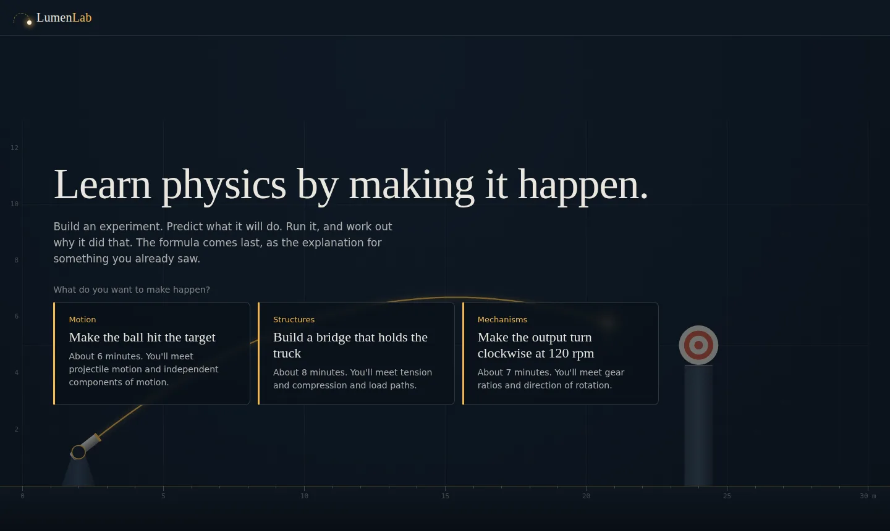](https://lumenlab-blond.vercel.app/)


LumenLab is a physics laboratory in the browser where you don't start with the formula. You start by trying to make something happen: build an experiment, predict what it will do, run it, look at what actually happened, change something, and try again. The equation arrives at the end, as the explanation for something you've already seen.

It has three experiments, each with a transfer task, all running on one shared learning loop:

| | Experiment | You build | You discover |
| --- | --- | --- | --- |
| 01 | Make the ball hit the target | Launch angle and speed | Two independent motions: constant sideways, accelerating vertically |
| 02 | Build a bridge that holds the truck | A steel truss from beams and joints | Tension and compression, load paths, why triangles are rigid |
| 03 | Make the output turn clockwise at 120 rpm | A gear train around a housing | Every mesh reverses direction; only the end gears set the speed |

No accounts, no backend, no AI in the product. Everything runs in the browser and works offline once loaded.

## Demo video

[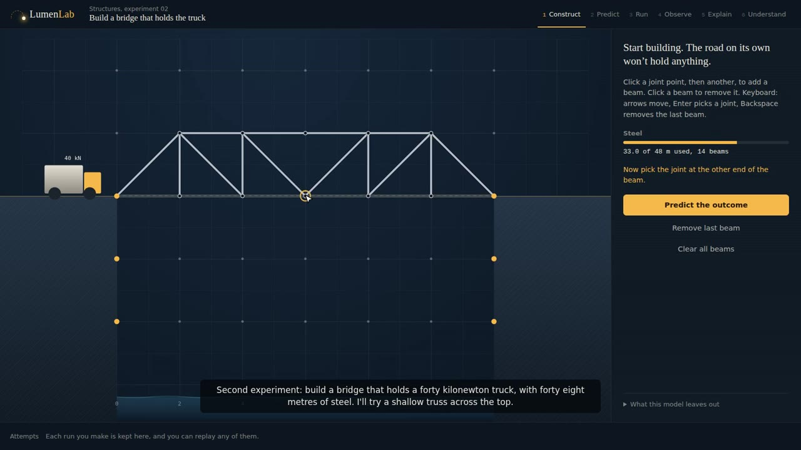](docs/media/lumenlab-demo.mp4)

**[▶ Watch the demo (2 min 25 s, MP4)](docs/media/lumenlab-demo.mp4)**. It walks through all three experiments: a missed shot and a hit, a bridge that collapses and one that holds, and a gear train that reaches its target, each followed by the physics reveal.

## Built for Beginner's Paradise: FirstCommit 2026

LumenLab was started from scratch during **Beginner's Paradise – FirstCommit 2026**, an online hackathon focused on learning, creativity, technical understanding, execution and presentation. Here is where each of those shows up in this project:

| Judging focus | In LumenLab |
| --- | --- |
| **Learning** | Three physics engines written from scratch instead of pulling in a physics library: numerical integration, a truss stiffness solver, and a gear constraint graph. Each is explained below and covered by tests. |
| **Creativity** | Physics taught backwards: challenge first, prediction before running, formula last. Each experiment ends with a transfer task (the Moon, an off-centre truck, a reversed gearbox). |
| **Technical understanding** | Deterministic simulations, pure evaluators and a pure state machine. The same inputs always give the same result, which is what makes replay and 42 tests possible. |
| **Execution** | Three complete experiments, keyboard and screen-reader support, responsive layout, reduced-motion support, and no fake or placeholder features. |
| **Presentation** | Real screenshots below, a narrated demo video, a changelog, and a visible commit history. |

---

## Why this exists

Physics is usually taught rule first: here is `F = ma`, now apply it. Most students can recite the rule and still can't predict what a thrown ball will do.

Interactive simulations already exist, and some are excellent. [PhET](https://phet.colorado.edu) offers hundreds of research-based simulations built around open exploration. [Algodoo](https://www.algodoo.com) is a freeform 2D physics sandbox. LumenLab is not trying to be a prettier version of either. Its focus is narrower:

| Existing tools mostly offer | LumenLab builds around |
| --- | --- |
| A simulation you can explore | A **challenge** you have to achieve |
| Manipulating parameters | **Predicting** before you run, then comparing |
| Free play | A **structured experiment** with a measured result |
| Success or failure | A short **reflection** on what surprised you |
| A formula alongside the sim | A **reveal** of the formula, checked against *your* run |
| Finishing a level | A **transfer** task that tests the idea, not the setting |

The simulation is not the lesson. The experiment is the lesson.

## The learning loop

```
CHALLENGE → CONSTRUCT → PREDICT → RUN → OBSERVE → EXPLAIN → REVISE ─┐
                                                     ↑              │
                                                     └──────────────┘
                              after success → UNDERSTAND → TRANSFER
```

The loop is shown in the top bar the whole time. All three experiments use exactly the same state machine, attempt history, replay, reflection, reveal and notebook export. Only the engine and the build controls differ.

## Experiment 01: Make the ball hit the target

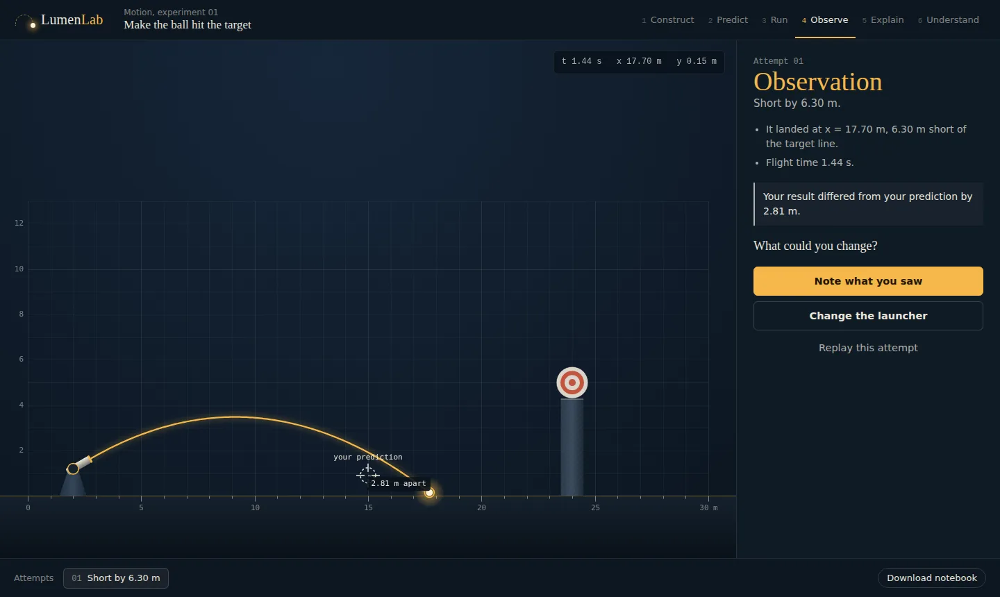

One launcher with an angle (10° to 80°) and a speed (8 to 20 m/s), and a target on a tower 22 m away. You aim by dragging the barrel, the sliders or the arrow keys, then place a marker where you think the ball will first touch something. Results are measured facts, not grades: "It landed at x = 17.70 m, 6.30 m short of the target line." Only about 4.5% of reachable settings hit the target.

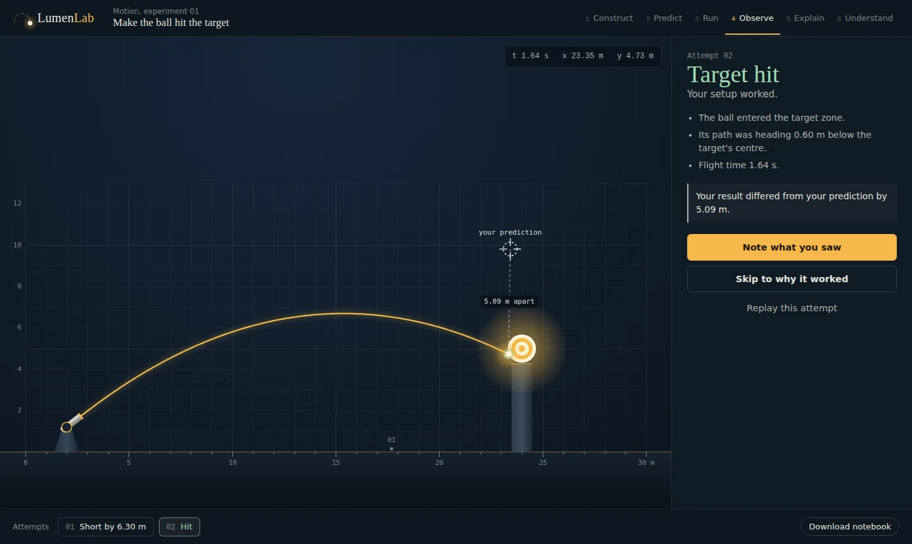

**Reveal.** Your winning shot replays with dots every 0.2 s dropped to the ground. The ticks are evenly spaced, the cyan horizontal velocity arrow never changes, and the coral vertical arrow shrinks, vanishes at the top and grows downward. Then the equations are filled in with your numbers and compared with what the simulation measured.

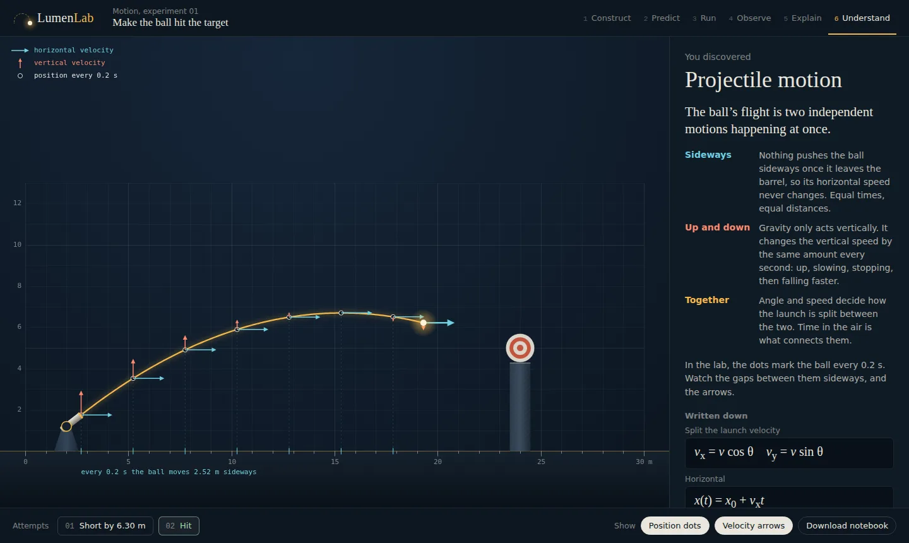

**Transfer.** Your winning settings are carried to the Moon (g = 1.62 m/s²). Every Earth solution overshoots there; a test checks this.

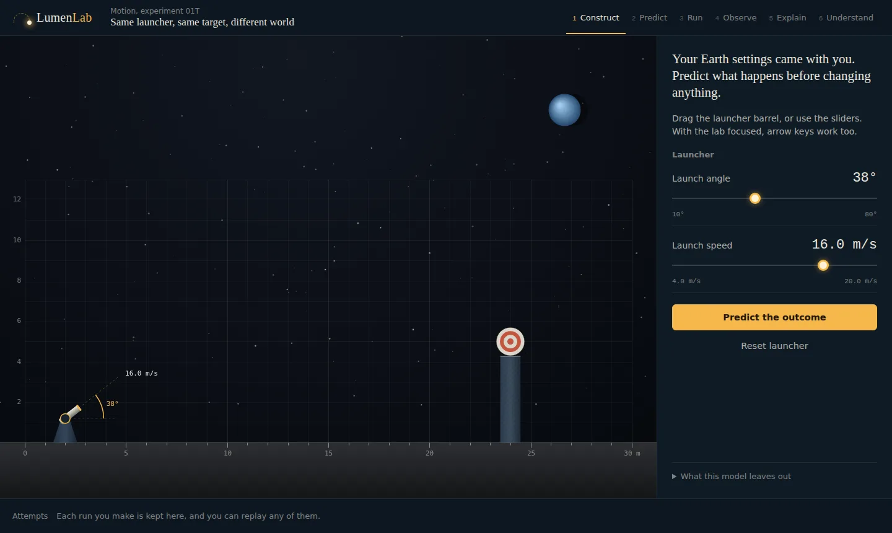

## Experiment 02: Build a bridge that holds the truck

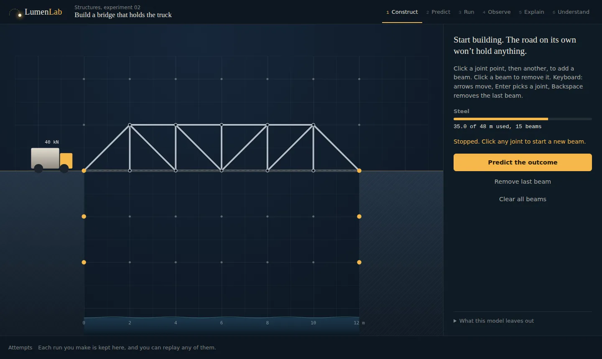

A road spans a 12 m gap, but nothing holds it up. You add steel beams between joint points (up to 4.5 m long, 48 m of steel in total). The cliffs have anchors at road level and below. Then you predict: will it hold the 40 kN truck? If you think it fails, you can click the beam you think breaks first.

When it runs, the truck is lowered on and the load ramps up. Beams warm from steel to amber to red as they approach their limit.

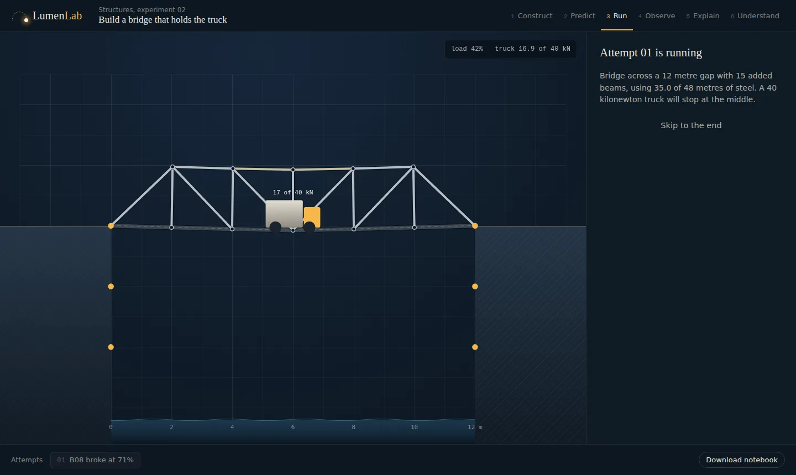

If a beam passes its limit it snaps, its load moves to other beams, and if the structure can then move freely it collapses into the river. Any attempt can be replayed from the history bar; bridge replays run in slow motion.

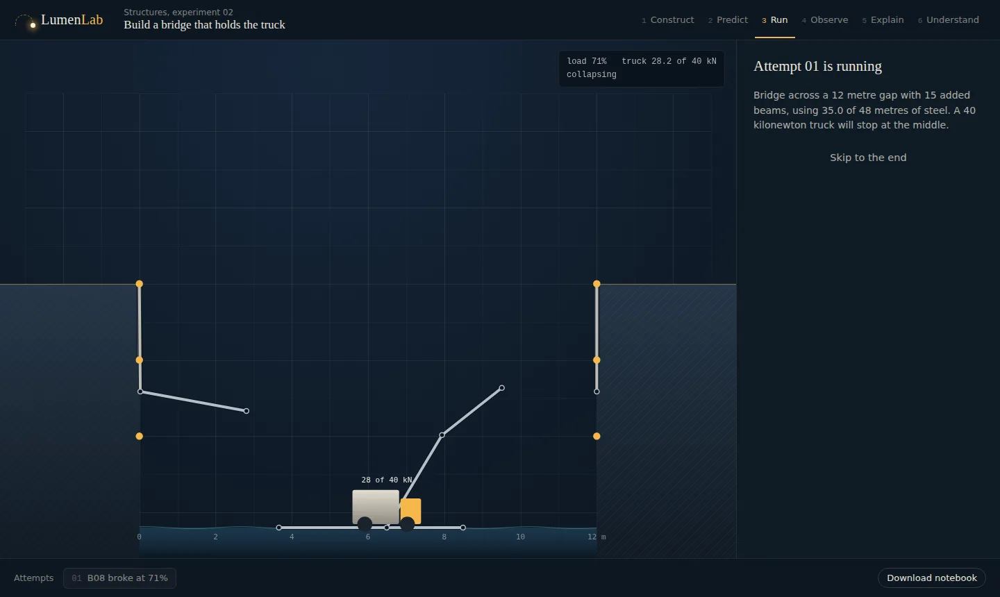

The result says exactly what happened: "B08 was pushed past its limit at 71% of the full load (55.0 kN of compression). Then the joint at (10 m, 2 m) could move freely and the bridge collapsed." A road with no supports doesn't break at all; it folds, and the result says so.

**Reveal.** Beams turn cyan if pulled and coral if pushed, with thickness showing force. The panel lists your four most loaded beams and checks equilibrium at the truck's joint: the beams pull up with exactly the force the truck and road push down.

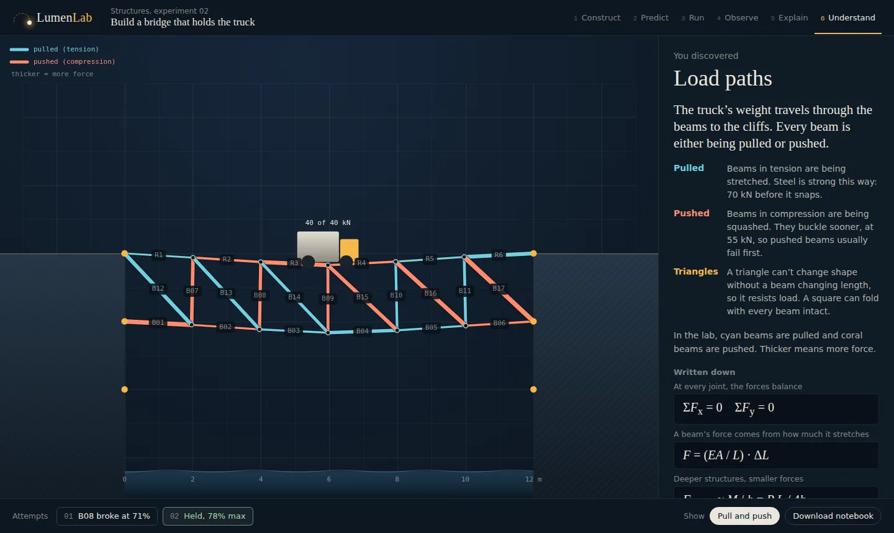

**Transfer.** The truck now stops 4 m from the left cliff. Same bridge, different load path; predict first.

## Experiment 03: Transfer the motion

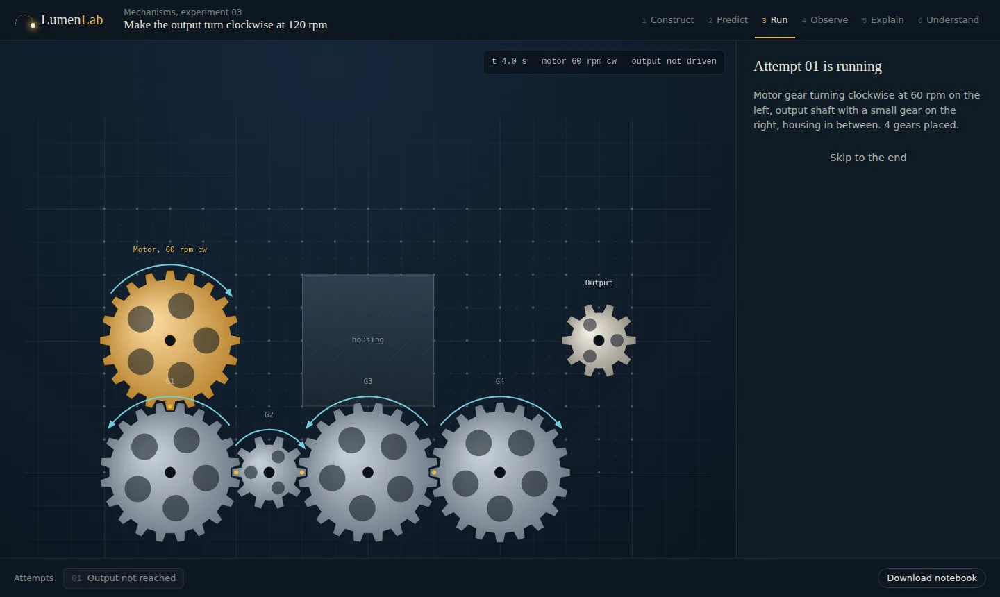

The motor turns clockwise at 60 rpm. The output shaft is on the far side of a housing. You place gears with 10, 15 or 20 teeth on pegs, and choose the gear on the output shaft. Gears only drive each other when their teeth touch, and the editor tells you what each new gear touches or why it can't go there.

You predict the direction (clockwise, counter-clockwise, or won't turn) and whether it will be slower, the same or faster than the motor. Three different failures are possible and each is explained: the chain never reaches the output; it reaches it at the wrong speed or direction; or an odd loop of meshes makes the train lock up.

**Reveal.** Every gear shows its speed and direction, and the panel works through the train mesh by mesh, then checks the formula `ω_out = (−1)^n · ω_in · r_in / r_out` against the simulation.

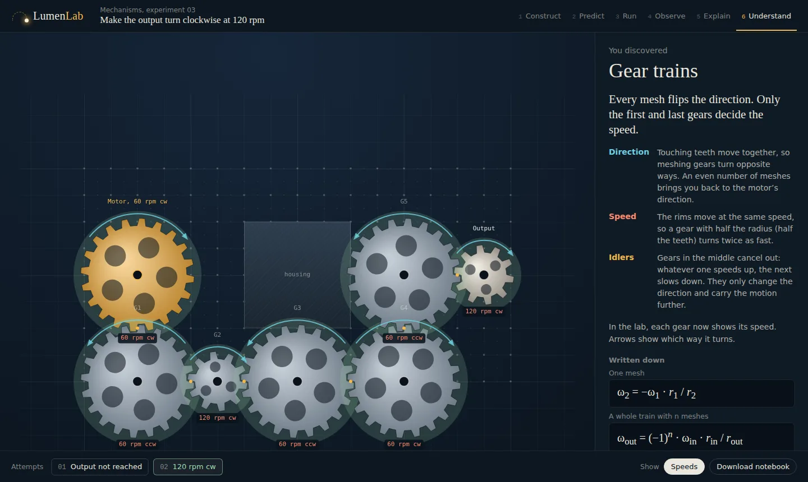

**Transfer.** Now make the output turn counter-clockwise at 60 rpm. Direction and speed have to be changed separately: the count of meshes for one, the end gears for the other.

## How it works

### Architecture

```
src/
  engine/            Deterministic physics. No DOM, no clock, no randomness.
    projectile.ts      Fixed-step integrator + continuous collision detection
    truss.ts           Direct stiffness method + progressive failure + collapse animation
    linalg.ts          Gaussian elimination that reports singular (floppy) systems
    gears.ts           Gear meshing as a constraint graph, propagated by BFS
  evaluator/         Success conditions as data → verdict + measured details
  experiments/       One module per experiment, behind a shared interface
    module.ts          simulate, evaluate, predictions, measurements, describe
  lessons/           Lesson definitions (pure data), six lessons
  experiment/
    machine.ts         The learning loop as a pure reducer
    replay.ts          Replay by re-simulation (cached)
  ui/
    renderer.ts        Painter: world→screen mapping, shared drawing helpers
    scenes/            Canvas drawing for each experiment
    app.ts             Panels, input, animation loop
tests/               Vitest: engines, evaluators, editing rules, state machine, replay
```

Dependencies point one way: `ui → experiment → experiments → evaluator → engine`. Nothing below `ui/` touches the DOM, so all of it runs in Node tests.

### One interface, three experiments

Each experiment implements `ExperimentModule` (`src/experiments/module.ts`): default config, sanitise, simulate, evaluate, empty prediction, prediction check, prediction feedback, playback duration, reveal measurements and a plain-language description. The state machine only talks to that interface, which is why adding the bridge and the gears needed no changes to the learning loop.

### Projectile engine

- **Fixed time step** of 1/120 s. Wall-clock time never enters the simulation.
- **Velocity Verlet integration**, which is exact for constant acceleration. A test checks every frame against the textbook formula to 9 decimal places.
- **Continuous collision detection**: each step is sampled at 8 points along the exact path, and the first contact is refined by 30 rounds of bisection, so a fast ball can't skip through the tower.

### Bridge engine

- **Pin-jointed truss.** Joints are hinges and beams only push or pull.
- **Direct stiffness method.** For each beam, the 2×2 stiffness block `(EA/L)·[c² cs; cs s²]` is added into a global matrix `K`. Solving `K·u = F` gives joint displacements; each beam's force is `(EA/L)` times its change in length.
- **Mechanism detection.** If the elimination hits a zero pivot, some joint can move without any beam changing length: the structure can fold. That is reported as a collapse, with the joint.
- **Progressive failure.** The model is linear, so the load at which a beam reaches its limit is `limit / force at full load`. The weakest beam breaks, it is removed, and the structure is solved again, until it carries the full load or becomes a mechanism.
- **Collapse animation.** Only when the analysis finds a collapse, the fall is animated with position-based dynamics (Verlet integration plus beam-length constraints). This part is illustration; the verdict always comes from the static analysis.

### Gear engine

Two gears mesh when their centres are exactly `r₁ + r₂` apart. Meshing gears turn opposite ways with matching rim speed: `ω₂ = −ω₁ · r₁ / r₂`. Motion spreads from the motor by breadth-first search. If the search reaches a gear that already has a different speed, the constraints contradict each other (an odd loop of meshes) and the whole train locks. Teeth are phased so that meshing gears visibly interleave as they turn.

### Deterministic evaluation and replay

Success conditions live in lesson data: `target-hit`, `survives-load`, `output-rpm`. Evaluators are pure functions and report only what the engine computed. A run is stored as its lesson id and config; replay simply simulates again, and tests assert that re-simulating a stored run reproduces its recorded evaluation exactly.

### State machine

`machine.ts` is a reducer: `reduce(state, action) → state`. Actions that don't make sense in the current step return the same state object. That is how five fast clicks on Run create one run, how Run is impossible without a prediction, and how a config of the wrong kind can never get into a lesson.

## Design decisions

- **A blueprint-blue lab with one light source.** The canvas is a deep cyanotype blue with a metre grid, so it reads as a lab bench rather than a website. The amber "lumen" colour is kept for the ball, stress, the motor and the main action.
- **Colour means the same thing everywhere.** Cyan and coral are always the two halves of the idea: horizontal and vertical velocity, pulled and pushed beams, direction and speed.
- **Serif headings, mono only for measurements**, so numbers that come from the simulation look measured.
- **No scores, no streaks.** The attempt history is there for reasoning, not ranking.
- **Nothing fake.** Every visible control works.
- **No AI in the product.** Hints are authored per lesson and unlock one at a time. Evaluation is deterministic.

## Physics honesty

Each lesson shows "What this model leaves out" in the app.

- **Projectile:** point mass, uniform gravity, no air resistance or spin, no bounce.
- **Bridge:** pin joints, axial forces only, weightless beams, road weight 4 kN per joint, limits of 70 kN tension and 55 kN compression. Deflection is real (millimetres) but drawn exaggerated, and the factor is shown. The collapse animation is simplified rigid-body motion.
- **Gears:** ideal rigid gears with radius proportional to tooth count. Direction and speed only; no torque, friction, backlash or inertia.

None of these predict real-world safety or performance. They are built to make one idea visible.

## Accessibility

- Native controls throughout. The launcher, prediction marker, bridge joints and gear pegs all work with the keyboard (arrow keys to move, Enter to act, Backspace to undo a beam, 1/2/3 to pick a gear size).
- Focus moves to each step's main action; results are announced to screen readers; the canvas has a text description of the current setup.
- `prefers-reduced-motion` removes the countdown, impact effects and screen shake.
- Meaning never relies on colour alone: every result is written out in words and numbers.

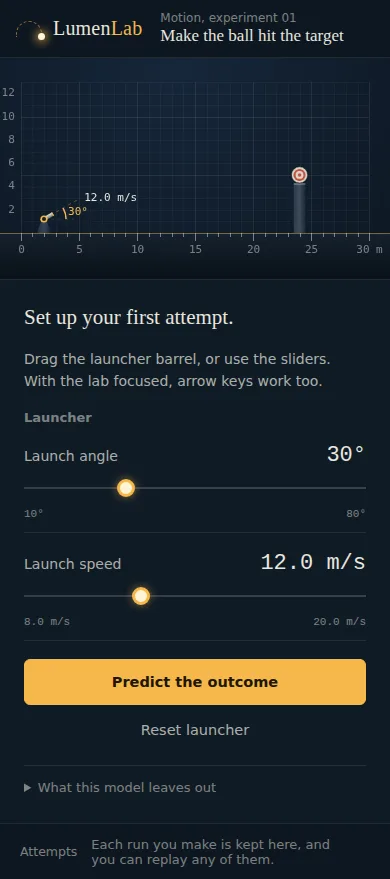

## Tech stack

- TypeScript, no UI framework
- Canvas 2D
- Vite for the dev server and build
- Vitest for tests

## Run it locally

```bash
git clone https://github.com/Abdullah49645/lumenlab.git
cd lumenlab
npm install
npm run dev        # http://localhost:5173
npm test           # 42 tests
npm run build      # type-check and build to dist/
```

The build is static (`base: './'`) and can be served from GitHub Pages, Netlify or any static host.

## Testing

`npm test` runs 42 tests in Node:

- **Projectile:** determinism, exact analytic match, ground contact, first-contact correctness, apex, no NaN/Infinity across the control range; every evaluator verdict; both lessons solvable; every Earth answer overshoots on the Moon.
- **Bridge:** the linear solver and singular detection; an unsupported road folds with no beam broken; an under-deck truss holds within budget; a shallow truss fails in compression then collapses; forces balance at the loaded joint; determinism of the full animation; a collapse actually drops the truck; the animation stays finite and above the water; every editing rule; the transfer case.
- **Gears:** one mesh reverses and scales speed; a disconnected output isn't driven; an odd loop jams; overlap and housing checks; determinism; the main and transfer challenges are solvable; an idler changes direction but not speed.
- **State machine:** prediction required, repeated Run presses ignored, clamping and reset, reflection flow, reveal only after success, replay reproduces the recorded evaluation, transfers carry configs, and the same loop drives all three experiments.

## Known limitations

- The camera is fixed; on the Moon a strong shot leaves the frame (the result says so).
- Bridge joints sit on a 2 m grid, and gears on a half-unit peg grid.
- Runs and reflections last for the session; "Download notebook" exports them as JSON, but nothing is saved between visits.
- No sound.

## Credits

- No third-party code, images, fonts or icons are included. Typefaces are the fonts already installed on the viewer's system.
- Dev tooling: [TypeScript](https://www.typescriptlang.org) (Apache-2.0), [Vite](https://vitejs.dev) (MIT), [Vitest](https://vitest.dev) (MIT).
- Demo video voiceover: [Piper](https://github.com/rhasspy/piper) text-to-speech (MIT), "Ryan" voice trained on the RyanSpeech dataset, licensed [CC BY-NC-SA 4.0](https://creativecommons.org/licenses/by-nc-sa/4.0/). The voiceover is used non-commercially and is not part of the app.
- Prior art that shaped the positioning: [PhET Interactive Simulations](https://phet.colorado.edu) (University of Colorado Boulder) and [Algodoo](https://www.algodoo.com).

## AI usage

AI assistance was used significantly in this project. Claude (Anthropic) generated much of the implementation (the three engines, evaluators, lesson data, state machine, UI and tests), this README, and the  AI voiceover of the demo video, from a detailed design brief written by the author. The author reviewed and tested the code, directed the product and learning design, and is responsible for the final decisions.

## License

The source code is released under the [MIT License](LICENSE) © 2026 Abdullah49645. You can use, copy, modify and share it, as long as the license notice is kept.

The demo video's voiceover is the one exception: it uses a CC BY-NC-SA 4.0 voice model (see Credits), so the video file itself is shared for non-commercial use.
